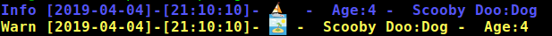

# Outburst
Simple, light weight, lazy logging which gets out of your way.

I'm not looking to replace propper loggers like the impressive [Logrus](https://github.com/sirupsen/logrus) I'd
recommend you consider it, but I think there is a need to have quick dirty and
convienient logging - like outburst. Logging which:
- is easy to set up and configure
- shorter to use than `fmt.Println()`
- has shiny colored fonts in the terminal
- supports emojis if you want them
- outputs to a file if/when needed

## Start Here

0. Get - as you would any other go package

```bash
go get github.com/areThereAnyUserNamesleft/outburst
```

1. Import - consider using `ob` as a convienient alias
```go
import ob "github.com/areThereAnyUserNamesLeft/outburst"

```
2. Initiate - consider calling it log or whatever
```go
	log := ob.NewOutBurst()
```
3. Log - see examples
> Example 1 - Key - Value logging:
```go
	log.Out(ob.Knot{"Scooby Doo": Dog, "Age": 4}).Burst(ob.Info)

	// Or if you want an even shorter version!

	log.Info(ob.KV{"Scooby Doo": Dog, "Age": 4})

	// (Hint - Knot and KV are the same data structure)
```

> Both the above give you some nice output in your logfile
```
Info [2019-03-30]-[15:40:31]- Scooby Doo:Dog -  Age:4
```
> or some nicely colored loglines in the terminal

> Additionally, the output can be colored and have emojis to reflect the error.
# Configured by a yaml file

The default settings are handled by a yaml file in your projects root - see `outburst.yaml` for an example.

Extra convienience functions -
### Error Logging
```go
log.ErrCheck(err, ob.KV{"Scooby Doo": Dog, "Age": 4})

// replaces

if err != nil {
    log.Error(cb.KV{"Error": err, "Scooby Doo":Dog, "Age": 4})
}

// The Knot/KV is an optional parameter so you can include them or not or include multiple.
```
